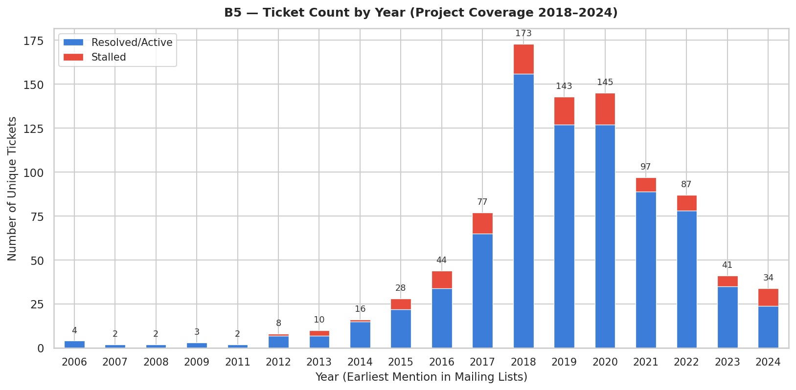
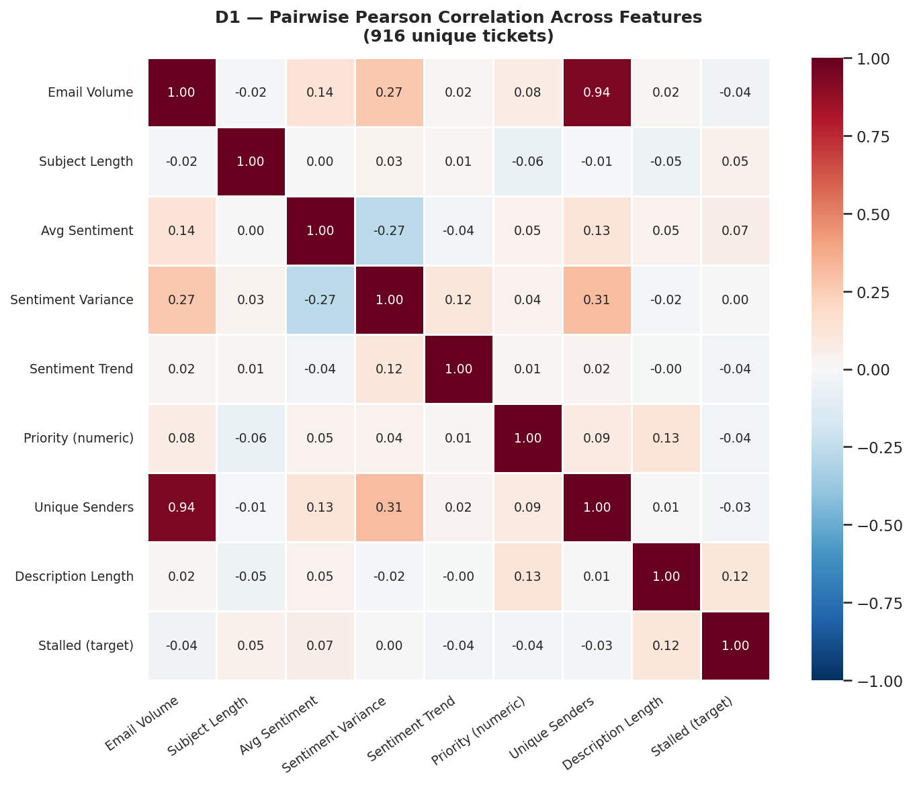
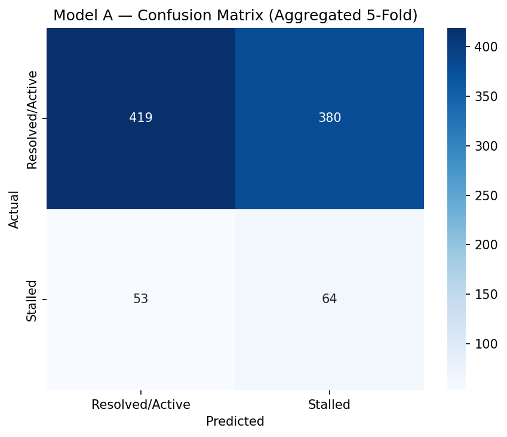
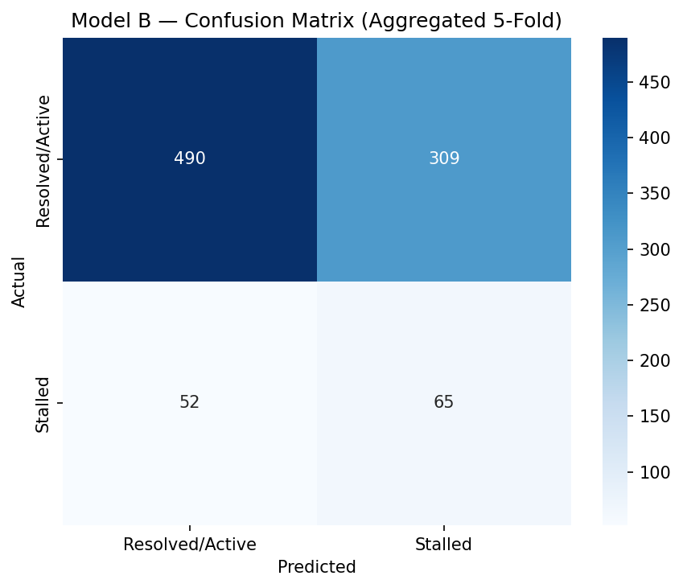

# Predicting Ticket Stalling Using JIRA and Email Sentiment Analysis
 
A controlled empirical study on whether developer **communication patterns alone** can predict stalled software tickets — without relying on structural project metadata.
 
> **TL;DR** — On 916 Apache Hadoop tickets across 7 years, a 7-feature communication-only model (Model A) matches a 19-feature model (Model B) that adds structural metadata. The recall difference is 0.010, well within cross-validation fold variance. Communication signals carry most of the predictive information.
 
website link:-https://ticket-stall-predictor.streamlit.app/


---
 
## Project Context
 
Master of Science (Integrated) in Data Science — final-year project.
**Goa Business School, Goa University**, 2025–2026.
Supervised by **Dr. Swapnil Fadte**, Department of Computer Science and Technology.
 
**Team:** Rudresh Achari (2330) · Unnat Umarye (2303) · Sarvadhnya Patil (2321) · Samuel Bhandari (2308) · Harsh Palyekar (2329)
 
---
 
## The Question
 
Software development is socio-technical: how a team *talks* about a ticket carries information that structured fields (priority, type, project) miss. Prior work has shown both communication sentiment and structural lifecycle features can predict ticket outcomes, but the two have rarely been compared **head-to-head under controlled conditions**.
 
**Hypothesis:** A model trained only on communication-derived features (Model A) achieves comparable predictive performance to a model that adds structural project metadata (Model B).
 
If true, communication-only monitoring becomes a viable approach for projects where rich structural metadata isn't available.
 
---
 
## Dataset
 
| Source | Detail |
|---|---|
| **Subprojects** | HADOOP, HDFS, YARN, MAPREDUCE |
| **Window** | 2018–2024 |
| **Tickets (raw)** | Apache JIRA REST API |
| **Emails** | 4 dev mailing lists × 7 years × 12 months = 336 mbox files |
| **Final dataset** | **916 unique tickets** (after the funnel below) |
 
**Pipeline funnel:**
 
| Stage | Records |
|---|---|
| Raw email–ticket links | 112,162 |
| After deduplication | 46,553 |
| After date filtering | 46,486 |
| After bot filtering | 5,950 |
| **Unique tickets (modelling input)** | **916** |
 
Class distribution: 117 stalled (12.8%), 799 active/resolved (87.2%) — a ~7.1:1 imbalance handled via stratified CV and class weighting (no SMOTE).
 
<p align="center">
  
</p>
---
 
## Methodology
 
### Pipeline (7 stages)
 
```
  Script 01 ──▶  Script 02 ──▶  Script 03 ──▶  Script 04 ──▶  Scripts 05/05b ──▶  Script 06
  Acquire        Link + Score   Merge          Engineer         Train + Eval        SHAP
  raw data       sentiment      datasets       features         Model A vs B        analysis
```
 
1. **Data acquisition** (`01_data_acquisition.py`) — JIRA REST API + Apache mbox archives.
2. **Entity linking + sentiment** (`02_entity_linking.py`) — regex-link emails to tickets via `\b(HADOOP|HDFS|YARN|MAPREDUCE)-\d+\b`; bot-filter; clean text; score with VADER.
3. **Dataset merging** (`03_dataset_merger.py`) — join email-level data with JIRA metadata, deduplicate.
4. **Feature engineering + ticket-level aggregation** (`04_feature_engineering.py`) — compute features, aggregate to one row per ticket *before* any train/test split (prevents leakage).
5. **Model evaluation** (`05_model_evaluation.py`, `05b_model_evaluation_structural.py`) — stratified 5-fold CV across 3 classifiers.
6. **SHAP analysis** (`06_shap_analysis.py`) — feature attribution.
7. **EDA visualisations** (`07_eda_visualizations.py`) — distributions, correlations, class balance.
### Why VADER (not BERT/RoBERTa)
 
Three reasons: (1) **computational tractability** — scores tens of thousands of emails in seconds, no GPU; (2) **transparency** — rule-based, fully inspectable; (3) **established practice** — the dominant tool in MSR sentiment research, enabling direct comparability. Limitations on technical text are well-documented and acknowledged. Transformer-based scoring is identified as future work.
 
A custom `strip_quoted_text()` function removes quoted replies, signatures, code blocks, stack traces, and log lines before scoring — these systematically contaminate VADER's lexicon-based scores.
 
### Target variable
 
A ticket is **stalled** if it has no recorded resolution date AND its current status is not in `{Patch Available, In Progress, Reopened}`. The blocklist of active-work statuses prevents healthy tickets from being mislabelled.
 
### Two feature sets
 
**Model A — Communication only (7 features):**
`email_count_per_ticket`, `subject_length`, `avg_sentiment`, `sentiment_variance`, `sentiment_trend`, `unique_senders`, `priority_numeric`
 
**Model B — Communication + Structural (19 features):**
All of Model A, plus `description_length`, 4 project one-hots (`proj_HADOOP`, `proj_HDFS`, `proj_YARN`, `proj_MAPREDUCE`), and 7 issue-type one-hots (`type_Bug`, `type_Task`, `type_Sub-task`, `type_Improvement`, `type_New Feature`, `type_Test`, `type_Wish`).
 
Every structural feature is observable at ticket creation — no leakage from progress-dependent fields like assignment, votes, or watchers.
 
### Evaluation
 
- **Stratified 5-fold CV** with `random_state=42` (identical fold assignments for both models).
- **Three classifiers:** Logistic Regression, Random Forest, XGBoost — all default hyperparameters (intentional — tuning would confound the A vs B comparison).
- **Metrics:** ROC-AUC (primary), recall on stalled class, precision, F1.
- **Class imbalance:** `class_weight='balanced'` for LR/RF, `scale_pos_weight` for XGBoost. No synthetic oversampling.
---
 
## Results
 
<p align="center">
  
</p>
*No single feature dominates — max |r| ≈ 0.11. Predictive performance must come from joint feature behaviour, not one strong signal.*
 
### Model A — Communication only (7 features)
 
| Classifier | Recall (Stalled) | Precision | ROC-AUC |
|---|---|---|---|
| **Logistic Regression** | **0.548 ± 0.211** | 0.145 | 0.564 |
| Random Forest | 0.112 ± 0.162 | 0.156 | 0.599 |
| XGBoost | 0.214 ± 0.176 | 0.185 | 0.568 |
 
### Model A vs Model B — Logistic Regression (deployed config)
 
| Metric | Model A | Model B | Δ |
|---|---|---|---|
| Recall (Stalled) | 0.548 | 0.558 | **+0.010** |
| ROC-AUC | 0.564 | 0.632 | +0.068 |
 
The recall delta of 0.010 is two orders of magnitude smaller than fold variance (~0.21). The ROC-AUC delta of 0.068 is modest in absolute terms and required a **271% increase in feature dimensionality**.
 
**The hypothesis is supported.** Communication features carry most of the predictive signal; structural metadata adds little.
 
<p align="center">
  
  &nbsp;&nbsp;
  
</p>
*Left: Model A (7 communication features). Right: Model B (19 features). Visually near-identical confusion patterns.*
 
### Why Logistic Regression beat the ensembles
 
On 916 tickets with mostly low individual feature correlations (max |r| ≈ 0.11), the linear additive structure of Logistic Regression generalised better than RF/XGBoost, which over-fit noise patterns at this sample size. Detailed in Chapter 5.7 of the report.
 
---
 
## The Dashboard
 
A **Streamlit** app (`app.py`) operationalises Model A — deliberately the simpler model, consistent with the hypothesis result.
 
Features:
- Ticket selector across all 916 tickets
- Stall probability with risk-zone tagline
- Plain-language insights (e.g., *"Only 2 team members engaged — typical tickets have 5. Low engagement is the strongest stalling signal."*)
- Communication signals table with percentile-ranked status labels
- Per-email sentiment timeline (Plotly, colour-coded)
- Reveal-actual-outcome button for demo verification
Glassmorphism aesthetic, JetBrains Mono throughout, cyan/amber accent palette.
 

Run it:
```bash
streamlit run app.py
```
 
---
 
## Repository Structure
 
```
.
├── app.py                          # Streamlit dashboard (deploys Model A)
├── scripts/
│   ├── 01_data_acquisition.py      # JIRA + mbox download
│   ├── 02_entity_linking.py        # Parse, bot-filter, clean, score, link
│   ├── 03_dataset_merger.py        # Join emails ↔ JIRA metadata
│   ├── 04_feature_engineering.py   # Features + ticket-level aggregation
│   ├── 05_model_evaluation.py      # Model A — 7 communication features
│   ├── 05b_model_evaluation_structural.py  # Model B — 19 features
│   ├── 05c_confusion_matrices.py   # Confusion matrix figures
│   ├── 06_shap_analysis.py         # SHAP attributions
│   ├── 07_eda_visualizations.py    # EDA figures
│   └── archive_and_audits/         # Earlier iterations + audit scripts
├── models/                         # Serialised .pkl models + feature lists
├── charts/                         # Result figures (confusion matrices, EDA)
├── visuals/                        # SHAP plots, force plots, dashboard exports
├── tests/                          # Unit tests
└── data/                           # Empty in repo — see Data Access below
    ├── raw/.gitkeep
    ├── interim/.gitkeep
    └── processed/.gitkeep
```
 
---
 
## Reproducing the Pipeline
 
### Requirements
 
- **Python** 3.10+
- **RAM:** 16 GB workstation (no GPU needed)
- Standard scientific stack: `pandas`, `numpy`, `scikit-learn`, `xgboost`, `shap`, `vaderSentiment`, `mailbox`, `requests`, `joblib`, `streamlit`, `plotly`
```bash
pip install -r requirements.txt   # if you've added one — otherwise install above manually
```
 
### Run end-to-end
 
```bash
python scripts/01_data_acquisition.py        # ~hours — downloads JIRA + mbox archives
python scripts/02_entity_linking.py          # ~minutes — links emails to tickets, scores VADER
python scripts/03_dataset_merger.py          # seconds — joins datasets
python scripts/04_feature_engineering.py     # seconds — features + aggregation
python scripts/05_model_evaluation.py        # seconds — Model A
python scripts/05b_model_evaluation_structural.py  # seconds — Model B
python scripts/06_shap_analysis.py           # seconds — SHAP
python scripts/07_eda_visualizations.py      # seconds — EDA charts
streamlit run app.py                         # launch dashboard
```
 
All random seeds are fixed (`random_state=42`). Re-running produces identical metrics and dashboard outputs.
 
### Data Access
 
Raw data (~3.2 GB) is **not committed** to this repository. To regenerate:
 
- **JIRA tickets:** Apache JIRA REST API (`https://issues.apache.org/jira/rest/api/2/search`) — Script 01 handles pagination and rate limiting.
- **Mailing list mbox:** Apache archives at `https://lists.apache.org/list.html?<list>@hadoop.apache.org` for `common-dev`, `hdfs-dev`, `yarn-dev`, `mapreduce-dev`.
The pipeline writes to `data/raw/`, `data/interim/`, and `data/processed/` — all git-ignored.
 
---
 
## Limitations and Honest Caveats
 
The study reports modest absolute performance (ROC-AUC ≈ 0.56–0.63) and we treat this honestly rather than overselling. Specifically:
 
- **Single ecosystem.** Apache Hadoop has distinctive cultural and technical norms; results may not generalise to closed-source teams or other open-source ecosystems.
- **VADER on technical text.** Off-the-shelf lexicon scoring on developer email is documented as imperfect. Custom preprocessing mitigates but does not eliminate this.
- **Sample size.** 916 tickets after honest aggregation is modest — sufficient for the comparative experiment but limits the ceiling for non-linear models.
- **Conservative entity linking.** High-precision regex matching means tickets discussed without an explicit `PROJECT-NNNN` reference are not captured.
- **No hyperparameter tuning.** Intentional, to keep the A vs B comparison clean — but means absolute performance is a lower bound on what's achievable.
Full discussion of threats to validity in Chapter 6 of the project report.
 
---
 
## Future Work
 
- Replace VADER with a transformer fine-tuned on developer text (e.g., RoBERTa with SE-domain adaptation).
- Extend beyond Hadoop to additional Apache subprojects and other open-source ecosystems.
- Add interaction features and engineered combinations of the 7 communication signals.
- Temporal modelling of sentiment trajectories rather than aggregated summaries.
- Industrial validation with closed-source ticket + chat data (Slack, Teams) where available.
---
 
## Acknowledgements
 
We thank Dr. Swapnil Fadte for supervision, the Apache Software Foundation for maintaining the public archives that make this kind of research possible, and the foundational MSR work of Marco Ortu, Alessandro Murgia, Parastou Tourani, and Bram Adams that inspired this study.
 
---
 
## Citation
 
If you reference this work:
 
> Achari, R., Umarye, U., Patil, S., Bhandari, S., & Palyekar, H. (2026). *Predicting Ticket Stalling Using JIRA and Email Sentiment Analysis* [M.Sc. (Integrated) project report]. Goa Business School, Goa University.
